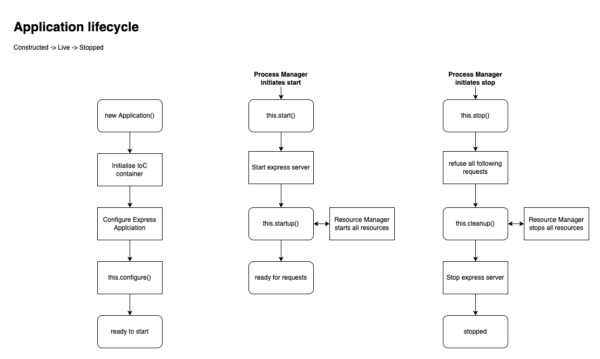
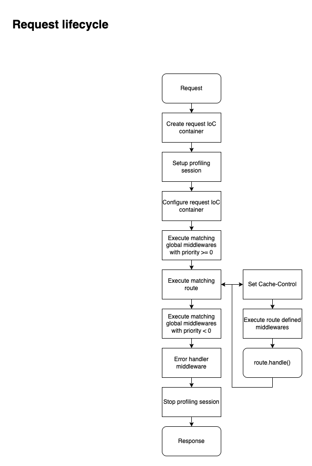

# @ts-awesome/rest

Typescript friendly REST wrapper for express.js

Key features:

* IoC friendly, see [invesify](https://github.com/inversify/InversifyJS)
* profiler support, see [@ts-awesome/profiler](https://github.com/ts-awesome/profiler)
* validation support, see [@ts-awesome/validate](https://github.com/ts-awesome/validate)
* helper for [PM2](https://github.com/Unitech/pm2) integration
* health checks and managed resources ecosystem
* powerful route helper:
  * ETag handling
  * Accept handling
  * model reader for input and output


## Bare use

```ts
import {httpGet, Route, useRoutes, useErrorHandler} from "@ts-awesome/rest";
import express from 'express';

@httpGet("/now")
class EchoRoute extends Route {
  async handle() {
    return this.json({
      now: new Date()
    });
  }
}

const app = express();

app.use(useRoutes(
  EchoRoute
));

// global error handler
app.use(useErrorHandler());

app.listen(3001, '0.0.0.0', () => {
  console.info(`Server is listening http://0.0.0.0:3001`)
});
```

You can use all decorated routes and middlewares with `useRestServer`. 
Please make sure to import relevant files beforehand.

```ts
import {httpGet, Route, useRestServer, IoCSetup, useIoC} from "@ts-awesome/rest";
import express from 'express';
import {useContainerModules} from "./server";

@httpGet("/now")
class EchoRoute extends Route {
  async handle() {
    return this.json({
      now: new Date()
    });
  }
}

// empty request scope binds
const rootIoCSetup: IoCSetup = () => [];
const requestIoCSetup: IoCSetup = () => [];

const app = express();

// setup root IoC container
app.use(useIoC(rootIoCSetup));

// bind all decorated routes and middlewares that are discoverable
app.use(useRestServer(requestIoCSetup));

app.listen(3001, '0.0.0.0', () => {
  console.info(`Server is listening http://0.0.0.0:3001`)
});
```

## Application

Make things more convenient this library offect BaseApplication class

```ts
import {
  BaseApplicationServer, 
  startDevServer, 
  IoCSetup, 
  useRestServer
} from "@ts-awesome/rest";

const rootIoCSetup: IoCSetup = () => [];
const requestIoCSetup: IoCSetup = () => [];

class DemoApplication extends BaseApplicationServer {

  constructor() {
    super(rootIoCSetup);
  }

  protected configure(app): void {
    // bind all decorated routes and middlewares that are discoverable
    app.use(useRestServer(requestIoCSetup));
  }
}

// start local dev server, or use startPm2Server for prod
startDevServer(new DemoApplication());

```

Now you have 2 endpoints that provide insight on app health

### /health/ready

Reports if app is ready to accept connections, has following response

```json
{
  "status":"UP",
  "checks":[]
}
```

### /health/live

Reports if app is in a good shape, has following response

```json
{
  "status":"UP",
  "checks":[]
}
```

## Application lifecycle



## Request lifecycle



## Route

Route handler typicly extends abstract `Route` class and define `handler` method

```ts
import {injectable} from "inversify";
import {
  httpGet,
  Route,
  requestParam
} from "@ts-awesome/rest"

// http operation
@httpGet('/hello/:world')
@cacheControl('no-store')
class HelloWorldRoute extends Route {
  async handle(
    // handle param decorators
    @queryParam('caps', Boolean, true) caps: boolean | null,
    @requestParam('world', String) world: string,
  ): Promise<void> {
    // reply with json
    return this.json({hello: caps ? world.toUpperCase() : world});
  }
}
```

### Supported http operations:

* @httpAll(path: string, ...middlewares) 
* @httpGet(path: string, ...middlewares) 
* @httpPost(path: string, ...middlewares)
* @httpPut(path: string, ...middlewares)
* @httpPatch(path: string, ...middlewares)
* @httpDelete(path: string, ...middlewares)
* @httpHead(path: string, ...middlewares)

### Supported handler params decorators:

* @queryParam(name, Model) equivalent to model read `req.query[name]`
* @bodyParam(name, Model) equivalent to model read `req.body[name]`
* @requestParam(name, Model) equivalent to model read `req.params[name]`
* @headerParam(name, Model) equivalent to model read `req.headers[name]`
* @cookieParam(name, Model) equivalent to model read `req.cookies[name]`
* @queryModel(Model) equivalent to model read `req.query`
* @requestBody(Model) equivalent to model read `req.body`

### Cache Control

* @cacheControl(type) supports:
  * immutable
  * public
  * private
  * no-cache
  * no-store

### utility members of `Route`:

* redirect - performs several kinds of redirects
* empty - respond with empty response
* json - respond with JSON response, also can be model read
* jsonAsync - wait for promise and respond with json
* text - respond with text response
* stream - respond and re-stream data


* ensureRequestMedia - check if client expects content type 
* getRequestMediaPriority - check how much client desires content type (0 is the most desired, null - non-desired) 
* getPreferredRequestMedia - return most desired content type of given list or null


* ensureCacheControl - sends Cache-Control header if possible, invoked by all response helpers
* setHeader - set response header value


* isNewerContent - check `If-None-Match` and `If-Modified-Since` request headers
* isNewerModel - compute ETag and check with `isNewerContent`
* isNewerList - compute ETag and check with `isNewerContent`
* ensureModelETag - throw if client expects older ETag
* setContentETag - set response ETag header
* setModelETag - compute ETga and `setContentETag`
* setListETag - compute ETga and `setContentETag`


* validate - perform validation and throw `BadRequestError` if fails

## Middlewares

Middlewares should implement `IMiddleware` interface

Global middlewares are decorated with `@middleware(priority)`. 
Middlewares are invoked from highest to 0 (pre route) 
and -1 to lowest (post route).

You can also list route specific middlewares in http operation decorates. 
Note: such middleware has to be decorated with `@injectable`.

```ts
@injectable
class SimpleMiddleware implements IMiddleware {
  async handle(
    req: IHttpRequest,
    res: IHttpResponse,
    // read header
    @headerParam('Authorization', String, true) authorization
  ): Promise<void> {
    // something should happen here
    // throw any error to cancel route execution and go to error handler
  }
}
```

Middleware can use handler params decorators to their benefit

Any error throw in middleware will cancel all subsequent middlewares and route, 
and go to Error handler middleware  

## Error handler middleware

A special middleware that implements `IErrorMiddleware`. 
Its `handle` method excepts err, req and res.

By default server already uses such middleware. 
If for any reason you need to change it, please bind your implementation to IoC container

```ts
import {Container} from "inversify";
import {IErrorMiddleware, ErrorHandlerMiddlewareSymbol} from "@ts-awesome/rest";

const container: Container;

class CustomErrorHandler implements IErrorMiddleware {
  async handle(err, req, res) {
    // handle err, do not call res.end();
  }
}

// some where IoC setup routine
container
  .bind<IErrorMiddleware>(ErrorHandlerMiddlewareSymbol)
  .to(CustomErrorHandler);
```

## Provided errors

### ForbiddenError

HTTP 403 Forbidden

### BadRequestError

HTTP 400 Bad Request

### NotFoundError

HTTP 404 Not Found

### UnauthorizedError

HTTP 401 Unauthorized

### RequestError

A generic error for non-standard situations. You can specify HTTP status code


## Health monitor and managed resources

Applications commonly may depends on external services like RDBMS or key-value storage.
Sometimes such services may require some setup and/or connection warm up.
For such cases we can use `ManagedResource`. It provides:

* `get title()` - provides human-readable resource name
* `async healthy()` - checks if resource is in a good shape
* `async start()` - establish connection or other preparations
* `async stop()` - close connections or other cleanup

Here is a sample `PostgresPoolHealthExamination` 

```ts
import {Pool} from "pg";
import {IManagedResource} from "@ts-awesome/rest";

function sleep(ms = 1000): Promise<void> {
  return new Promise(r => setTimeout(r, ms));
}

export class PostgresPoolHealthExamination implements IManagedResource {
  readonly title = 'Postgres Pool';

  public constructor(
    private readonly pool: Pool
  ) {
  }

  async start() {
    // eslint-disable-next-line no-constant-condition
    let delay = 250;
    while (!await this.healthy()) {
      await sleep(delay);
      delay = Math.min(3000, delay * 1.5);
    }
  }

  async stop() {
    try {
      await this.pool.end();
    } catch (e) {
      // ignored
    }
  }

  async healthy() {
    let client: PoolClient | null = null;
    try {
      client = await this.pool.connect()
      await client.query('SELECT 1');
      return true;
    } catch (e) {
      return false;
    } finally {
      client?.release();
    }
  }
}
```

To use it, please bind it to your container as follows

```ts
import {Container} from "inversify";
import {Pool} from "pg";
import {ExternalResourceSymbol, IManagedResource} from "@ts-awesome/rest"

const container: Container;
const pool: Pool;

// somewhere in your IoC initialization routine
container
  .bind<IManagedResource>(ExternalResourceSymbol)
  .toConstantValue(new PostgresPoolHealthExamination(pool))
  // name should be unique
  .whenTargetNamed('postgres pool');
```

For cases when you only need health checks, please use `IHealthChecker` and `HealthExaminationSymbol`

## IoC container setup technics

In 3.0.0 of this library, 
`IoCSetup` delegate should return `readonly ContainerModule[]` array.
This change is done to make IoC setup cleaner and modular.

It's advised to break IoC configuration into parts, 
for example configuring ORM with PG driver may look like following

```ts
import {ContainerModule} from "inversify";
import {Pool} from "pg";
import {ExternalResourceSymbol, IManagedResource} from "@ts-awesome/rest"
import {SqlQueryDriverSymbol, SqlQueryBuilderSymbol} from "@ts-awesome/orm";
import {ISqlQuery, PgDriver, PgCompiler} from "@ts-awesome/orm-pg";

export function configureOrmPgModule(pool: Pool): ContainerModule {
  return new ContainerModule(bind => {
    bind<IManagedResource>(ExternalResourceSymbol)
      .toConstantValue(new PostgresPoolHealthExamination(pool))
      .whenTargetNamed('postgres pool')

    bind<IQueryDriver<ISqlQuery>>(SqlQueryDriverSymbol)
      .toDynamicValue(() => new PgDriver(pool))

    bind<IBuildableQueryCompiler<ISqlQuery>>(SqlQueryBuilderSymbol)
      .to(PgCompiler)
  });
}
```

And `ioc.config.ts` can be like following:

```ts
import {Config} from "@ts-awesome/config"
import {Pool, PoolConfig} from "pg";

const config = new Config()

export function setupRootModules(): readonly ContainerModule[] {
  return [
    configureLoggerModule(
      config.get<ILoggerConfig>('logger'),
      config.get<IReporterConfig>('reporter')
    ),

    configureMailerModule(
      config.get('mailer', MailerConfig),
    ),

    configureOrmPgModule(
      new Pool(config.get<PoolConfig>('db'))
    ),

    // other root modules
  ];
}

export function setupRequestModules(): readonly ContainerModule[] {
  return [
    configureEntityServiceModuleFor(
      // SomeDbModel
    ),

    configureValidationModuleFor(
      // SomeModelInput
    ),
  ];
}
```

## Process management utils

### startDevServer

Useful for local development env, eg for use with nodemon. 
Kills app on unhandled exceptions.
App can be force-stopped with repeatable SIGTERM/SIGINT signals

### startPm2Server

Recommended to production use with [PM2](https://github.com/Unitech/pm2)


# License
May be freely distributed under the [MIT license](https://opensource.org/licenses/MIT).

Copyright (c) 2022 Volodymyr Iatsyshyn and other contributors
